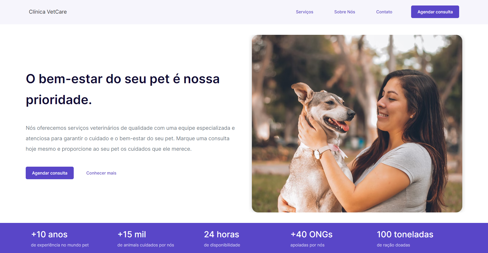

# Clínica VetCare

## Escopo 
O escopo do site da clínica veterinária inclui fornecer informações sobre a empresa, seus serviços, profissionais, localização, horário de atendimento, formas de contato e possibilidade de agendamento de consultas e serviços.

# Documentação

## 1. Introdução

Este documento de requisitos é uma parte essencial do processo de engenharia de software e tem como objetivo descrever os requisitos funcionais, não funcionais e regra de negócio para o desenvolvimento do sistema. Este documento é destinado aos stakeholders envolvidos no projeto, incluindo clientes, usuários finais, equipe de desenvolvimento, gerentes de projeto e outros interessados.

## 2. Visão geral do sistema

O objetivo do sistema é possibilitar o agendamento de exames para uma clínica veterinária, além disso devem ser exibidas informações sobre os tipos de consulta e seus objetivos, dados sobre o agendamento, exames e por fim dados básicos sobre a clínica, como localização, funcionamento, contato etc.

## 3. Situação atual

Atualmente a clínica encontra-se realizando agendamentos e vendas única e exclusivamente de modo presencial, o que gera situações inconvenientes tanto para clientes quanto para colaboradores, resultando em muitas vezes na perda de clientes e por consequência na de receita.

## 4. Requisitos funcionais

Os requisitos funcionais são aqueles que definem as principais caraterísticas e funções do software, ou seja, o que ele é deve ser capaz de fazer. Abaixo estão descritos os requisitos para este sistema.

| **ID** | **Descrição** |
| --- | --- |
| RF 01 | O usuário deve ser capaz de agendar uma consulta. |
| RF 02 | O cadastro de uma consulta deve incluir dados pessoais do tutor, dados sobre o pet e informações como dia e horário da consulta. |
| RF 03 | Enviar notificações a respeito do êxito ou possível falha no agendamento da consulta. |
| RF 04 | O site deve expor informações básicas sobre a clínica. |
| RF 05 | O site deve informar quais são os serviços, especialidades, exames e tipos de consulta disponíveis na clínica. |
| RF 06 | Possibilitar o contato com a clínica por meio de um formulário de contato ou número de telefone. |

## 5. Requisitos não funcionais

Os requisitos não funcionais descrevem as limitações e qualidades que o software deve ter como desempenho, segurança e usabilidade.

| **ID** | **Descrição** |
| --- | --- |
| RNF 01 | O sistema deve ser fácil de usar e navegar, mesmo para usuários iniciantes. |
| RNF 02 | O sistema deve ser seguro contra acesso não autorizado e proteger as informações confidenciais dos usuários. |
| RNF 03 | O sistema deve ser fácil de manter e atualizar sem que sua funcionalidade seja prejudicada. |
| RNF 04 | O sistema deve ser capaz de se recuperar de falhas de hardware ou software, sem perda de dados ou de serviço. |
| RNF 05 | O site deve ser responsivo, ou seja, se adaptar a diferentes tamanhos de tela de dispositivos móveis. |
| RNF 06 | O tempo de carregamento das páginas deve ser rápido para garantir uma boa experiência do usuário. |
| RNF 07 | O site deve estar disponível 24 horas por dia, 7 dias por semana para acessibilidade dos clientes. |

## 6. Regras de negócio

São requisitos relacionados especificamente ao escopo do projeto e suas necessidades.

| **ID** | **Descrição** |
| --- | --- |
| RN 01 | O sistema deve suportar diferentes tipos de animais, desde cães e gatos até animais e exóticos, como aves e répteis. |
| RN 02 | O sistema deve seguir as normas e padrões estabelecidos pelas instituições regulatórias para a gestão de dados e informações veterinárias. |

